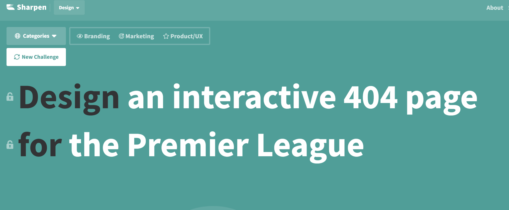

# mi349-lab11cssFramework
MI 349 Lab 11 Homework Assignment

# Lab Requirements

1. Create a new GitHub repository called "framework-challenge" and sync it with Codespaces/your development environment.
2. Create a new index.html file and any other supporting directory structure for your framework (you can use the boilerplate here).
3. Complete the prompt using the CSS framework of your choice.
4. Remember to validate your HTML using the W3C Validator.
5. Save, commit, and push your project to GitHub and deploy to Netlify.
6. Submit your Github repo link and public Netlify URL to D2L.
